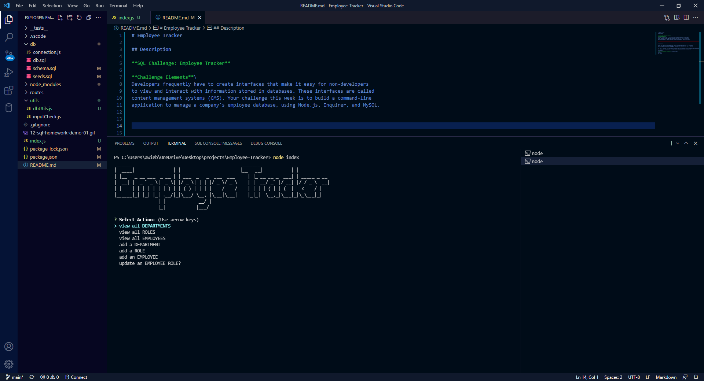

# Employee Tracker 

## Description 

**SQL Challenge: Employee Tracker**

**Challenge Elements**\
Developers frequently have to create interfaces that make it easy for non-developers 
to view and interact with information stored in databases. These interfaces are called 
content management systems (CMS). Your challenge this week is to build a command-line 
application to manage a company's employee database, using Node.js, Inquirer, and MySQL.

## Installation

Because this application won’t be deployed, you’ll also need to provide a link to a walkthrough 
video that demonstrates its functionality and all of the tests passing. You’ll need to submit a 
link to the video and add it to the README of your project.

-The link to the video: https://github.com/AWiebe2021/Team_Profile_Generator/blob/1f6a483d3318f2bab07bd3e0058fd18b678a0c14/Team_Profile_Generator.mp4 \
-The projects code can be accessed at: https://github.com/AWiebe2021/Team_Profile_Generator

## Screenshot

## Credits
Solo project
